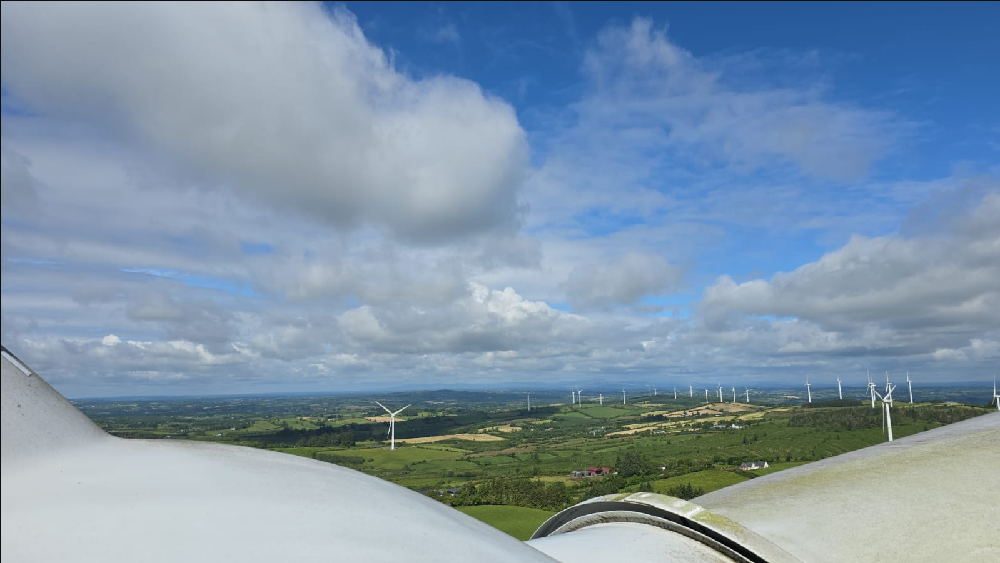
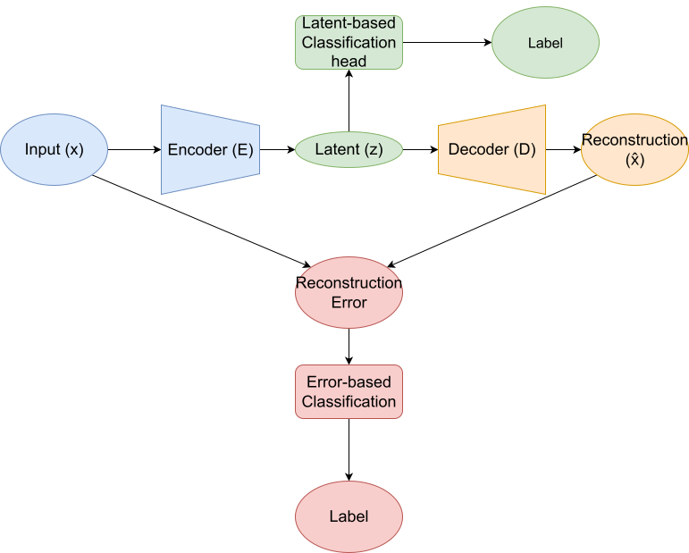
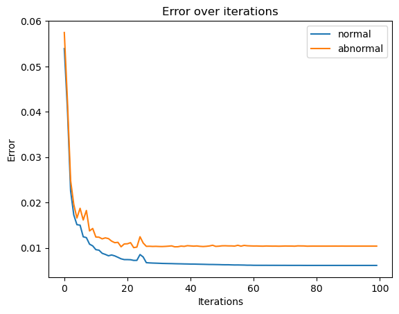
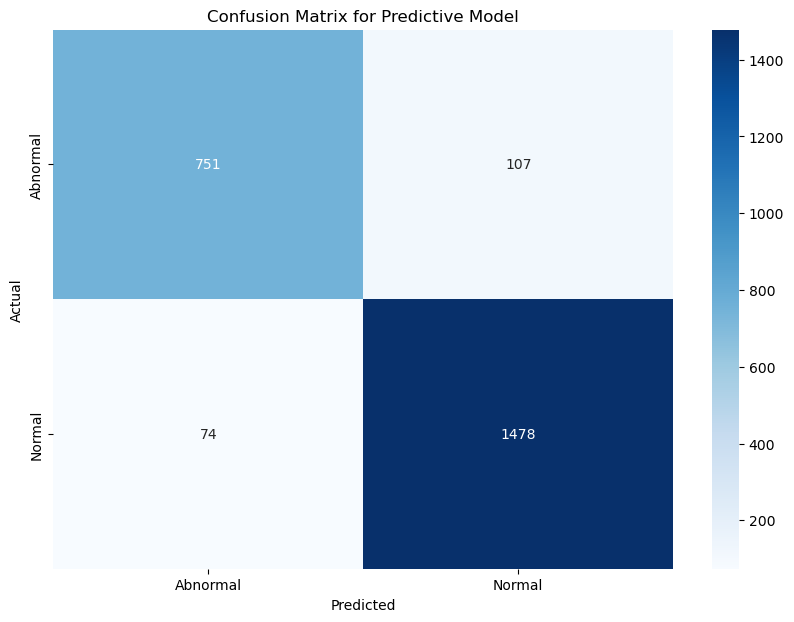

# Deep Reconstructive Normal Behaviour Models for Wind Turbine Condition Monitoring

*(MSc AI & ML Dissertation – Hoang Tu Bui, University of Limerick, 2025)*



> Exploring the capacity of Deep Reconstructive Normal Behaviour Models (AEs and variants) for anomaly detection in industrial wind-turbine SCADA data.
> *(Supervisor: Dr. Juan Albarracin · Co-Supervisor: Prof. Conor Ryan)*

## Related Documents

- **Dissertation**: See [Dissertation Repository](https://github.com/BuiHoangTu/ul.thesis).


---

## 🧭 Overview

This repository accompanies the **MSc Dissertation** titled
**“Exploring the Capacity of Deep Reconstructive Normal Behaviour Models in Wind Turbine Condition Monitoring.”**
It provides a full research-to-deployment pipeline for developing, benchmarking, and deploying deep autoencoder-based anomaly-detection systems on real-world SCADA data.

### Academic Objectives

* Evaluate **Autoencoder (AE)** families — *Vanilla, Multi-Head, Classification-Only, and Bottleneck AE* — under **unsupervised, semi-supervised, and supervised** paradigms.
* Propose and test an **Anomaly Reinforced Autoencoder (ARAE)** for data-scarce conditions.
* Examine auxiliary losses (**MMD, Wasserstein, Fourier, Mahalanobis**) and architectural augmentations (**Multi-Scale Attention Memory – MAMA**) on model robustness.
* Provide empirical guidance for **Wind Turbine Condition Monitoring (WTCM)** using industrial-grade SCADA signals.

### Engineering Deliverables

* Modular code under `src/nbm/` for data preprocessing, model definition, training, and evaluation.
* A deployable AWS CDK stack (`deploy/aws/`) enabling automated preprocessing and model-trigger pipelines.
* Environment specifications (`env.yml`, `env-dev.yml`) for full reproducibility.

---

## 🏗️ Repository Structure

```
.
├── data/raw/               # Example dataset & metadata
├── deploy/aws/            # AWS CDK infrastructure
│   └── README.md          # See this file for deployment details
├── src/nbm/               # Core research modules
│   ├── preprocess/        # Cleaning, normalization, windowing
│   ├── model_options/     # AE variants (vanilla, bottleneck, mama, etc.)
│   ├── train/             # Trainer, loss & metric definitions
|   ├── main.py            # Entry point for experiment runs
│   └── data_reader/       # Parquet & generic data loaders
├── notebooks/             # Jupyter experiments and ablations
├── models/                # Saved model weights / outputs
├── Makefile               # Convenience targets (train / eval / deploy)
└── README.md              # (this file)
```

---

## ⚙️ Quick Start

### 1 · Environment setup

```bash
conda env create -f env.yml
conda activate nbm-env
```

### 2 · Prepare data

Place turbine SCADA data (e.g., `example.csv`) under `data/raw/`.
Run preprocessing:

```bash
python -m nbm.preprocess
```

### 3 · Train a model

Example (Bottleneck AE):

```bash
python -m nbm --model bottleneck --config configs/bottleneck.yaml
```

### 4 · Evaluate

```bash
python -m nbm --evaluate --checkpoint path/to/model.pt
```

---

## 🧠 Methodological Highlights

| Component           | Description                                                                                                                                                         |
| ------------------- | ------------------------------------------------------------------------------------------------------------------------------------------------------------------- |
| **Dataset**         | Proprietary industrial SCADA (2019–2024, ~2.9 M records). Six key physical features: avg power, rotor speed, wind speed, air density, ambient temp, wind direction. |
| **Preprocessing**   | Interpolation → hourly resampling → min-max scaling → window segmentation (128 timesteps).                                                                          |
| **Architectures**   | CNN-based encoders + decoders; optional Multi-Scale Attention Memory (MAMA) & hashed latent memory.                                                                 |
| **Losses**          | MSE ± {MMD, Wasserstein, Fourier, Mahalanobis}.                                                                                                                     |
| **Evaluation**      | AUC, F1, Precision-Recall; comparison across label regimes.                                                                                                         |
| **Results Summary** | Bottleneck AE ≈ 0.998 AUC (labeled-data rich) · ARAE ≈ 0.85 recall at 1:4 imbalance · Purely unsupervised AE ≈ 0.5 AUC.                                             |


*Figure: Overall architecture diagram*



*Figure: Reconstruction error of normal samples vs abnormal samples*

---

## ☁️ Deployment (AWS)

A **AWS CDK** application under `deploy/aws/` packages preprocessing and training logic into containerized Lambda functions.

See [`deploy/aws/README.md`](deploy/aws/README.md) for deployment details.

---

## 📊 Reproducible Experiments

Jupyter notebooks in `notebooks/` replicate dissertation figures and tables:

* `dev-mama-bottleneck.ipynb` → Figure 5.8 / Table 5.6
* `dev-err-pred-e2e.ipynb` → Error-prediction analysis
* `power_curve.ipynb` → Baseline comparison (Regression models)


*Figure: Confusion Matrix of multi-head model*

---

## 🧩 Key Findings

* **Supervision helps:** label guidance yields near-perfect separability.
* **ARAE robustness:** consistent recall even under class imbalance.
* **Loss interaction:** Wasserstein / MMD complement MSE; excessive auxiliary terms can degrade performance.
* **Deployability:** lightweight CNN-based AEs feasible for on-edge or Lambda deployment.

---

## 🧾 Citation

If you reference this work, please cite:

> Bui, H. Tu (2025). *Exploring the Capacity of Deep Reconstructive Normal Behaviour Models in Wind Turbine Condition Monitoring.* MSc Dissertation, University of Limerick.

<!-- ---

## 📧 Contact


*Image 4: System deployment flow placeholder* -->

---
