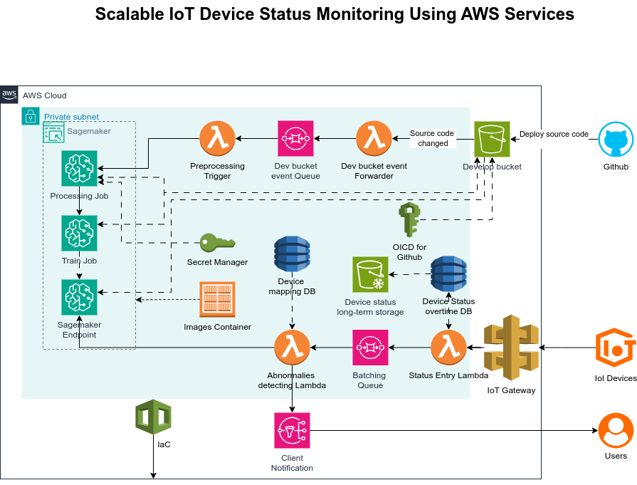

# Scalable IoT Device Status Monitoring Using AWS Services

This project implements a **serverless, scalable pipeline** for real-time monitoring of IoT devices — inspired by the EnergyPro wind turbine use case. It leverages **Amazon Web Services (AWS)** to ingest, process, analyze, and alert on device telemetry data using machine learning models hosted in **Amazon SageMaker**.  
It was developed as part of the *CS5024 – Theory and Practice of Advanced AI Ecosystems* module at the **University of Limerick**.

---

## 🌍 Overview

The system ingests telemetry from IoT sensors (e.g., vibration, temperature, power output), stores and queues it for evaluation by a **SageMaker-hosted CNN autoencoder**, and dispatches alerts when anomalies are detected.  
The architecture emphasizes **scalability**, **modularity**, and **security**, showcasing how AI/ML models can be operationalized in a production-grade AWS ecosystem.


*Figure: AWS Architecture for Automatic Normal Behaviour Monitoring*

---

## 🧩 Architecture Summary

**Key AWS components:**
- **API Gateway** – Public entry point for IoT telemetry ingestion.
- **AWS Lambda** – Handles status enrichment, SQS forwarding, and inference orchestration.
- **Amazon SQS** – Buffers telemetry and ensures decoupled, batch processing.
- **Amazon DynamoDB** – Stores device state and metadata with low-latency access.
- **Amazon S3 & Glacier** – Stores processed and archived telemetry data.
- **Amazon SageMaker** – Hosts the autoencoder model for real-time anomaly detection.
- **Amazon SNS** – Sends alerts to clients (email/SMS) when anomalies are found.
- **AWS Secrets Manager** – Secures decryption keys for protected data and GitHub access tokens.
- **AWS CDK** – Manages infrastructure as code, ensuring reproducibility and scalability.

---

## 📂 Repository Structure

```

deploy/aws/
├── app.py                      # CDK entry point
├── cdk.json                    # CDK configuration file
├── lambda/
│   └── preprocessing_trigger/  # Lambda for triggering processing pipeline
├── structure/
│   └── stack.py                # CDK stack definition
├── wrapper/
│   ├── processing/src/         # SageMaker processing job container
│   │   ├── app.py
│   │   ├── Dockerfile
│   │   └── training_trigger.py
│   └── train/src/              # SageMaker training job container
│       ├── app.py
│       └── Dockerfile
├── tests/                      # Unit tests for CDK structure
│   └── unit/
│       └── test_structure_stack.py
├── requirements.txt            # Deployment dependencies
├── requirements-dev.txt        # Development dependencies
└── README.md                   # (This file)
````

---


CDK will automatically:

* Build Docker images under `wrapper/processing` and `wrapper/train`
* Push them to Amazon ECR
* Create SageMaker Processing and Training pipelines
* Deploy Lambda functions and supporting resources (S3, SQS, SNS, DynamoDB)

---

## 🔐 Secrets and Configuration

Certain datasets and GitHub integration steps require access to encrypted content.
These credentials are **not stored locally** but instead managed through **AWS Secrets Manager**.

The following secrets should be configured before deployment:

* `github-access-token` – for OIDC-based access to S3 source uploads
* `data-decryption-key` – used for decrypting protected turbine telemetry
* `s3-bucket-name` – reference for input/output data storage

Secrets are automatically retrieved by AWS Lambda functions during runtime.

---

## 🧠 Model Summary

* **Architecture**: Convolutional Autoencoder (PyTorch)
* **Goal**: Detect deviations from normal turbine behavior
* **Deployment**: Real-time inference via SageMaker endpoint
* **Metrics**: Mean Squared Error (MSE), Maximum Mean Discrepancy (MMD), Wasserstein Distance

Training is triggered automatically when preprocessing or model code in GitHub is updated under the `aws-deploy` branch.
CDK handles container image management, artifact upload, and SageMaker job initiation.

---


## 📈 Scalability Highlights

* Fully **serverless architecture** – automatically scales with telemetry load.
* **SQS** buffers data for batch processing and isolates producers/consumers.
* **SageMaker Endpoint Auto Scaling** adjusts inference capacity dynamically.
* **S3 Glacier** provides cost-effective long-term data storage.
* **AWS CDK** ensures reproducibility across multiple environments or regions.

---

## 🧑‍💻 Author

**Hoang Tu Bui**

Student ID: 24005665

University of Limerick

Module: *CS5024 – Theory and Practice of Advanced AI Ecosystems*
Supervisor: *Patrick Denny*

---

## 📚 References

Refer to the detailed report *“Scalable IoT Device Status Monitoring Using AWS Services”* for figures, full citations, and implementation rationale.


# Welcome to CDK Python project!

## ⚙️ Setup and Deployment

### Prerequisites
- AWS CLI configured with appropriate permissions  
- AWS CDK v2 installed (`npm install -g aws-cdk`)  
- Python 3.10+  
- Docker (for building SageMaker containers)  

### Steps

1. **Set up a Python environment**
   ```bash
   python3 -m venv .venv
   source .venv/bin/activate
   pip install -r requirements.txt


2. **Bootstrap AWS CDK (first-time only)**

   ```bash
   cdk bootstrap aws://<ACCOUNT_ID>/<REGION>
   ```

3. **Deploy the infrastructure**

   ```bash
   cdk deploy
   ```


This is a blank project for CDK development with Python.

The `cdk.json` file tells the CDK Toolkit how to execute your app.

This project is set up like a standard Python project.  The initialization
process also creates a virtualenv within this project, stored under the `.venv`
directory.  To create the virtualenv it assumes that there is a `python3`
(or `python` for Windows) executable in your path with access to the `venv`
package. If for any reason the automatic creation of the virtualenv fails,
you can create the virtualenv manually.

To manually create a virtualenv on MacOS and Linux:

```
$ python3 -m venv .venv
```

After the init process completes and the virtualenv is created, you can use the following
step to activate your virtualenv.

```
$ source .venv/bin/activate
```

If you are a Windows platform, you would activate the virtualenv like this:

```
% .venv\Scripts\activate.bat
```

Once the virtualenv is activated, you can install the required dependencies.

```
$ pip install -r requirements.txt
```

At this point you can now synthesize the CloudFormation template for this code.

```
$ cdk synth
```

To add additional dependencies, for example other CDK libraries, just add
them to your `setup.py` file and rerun the `pip install -r requirements.txt`
command.

## Useful commands

 * `cdk ls`          list all stacks in the app
 * `cdk synth`       emits the synthesized CloudFormation template
 * `cdk deploy`      deploy this stack to your default AWS account/region
 * `cdk diff`        compare deployed stack with current state
 * `cdk docs`        open CDK documentation

Enjoy!
